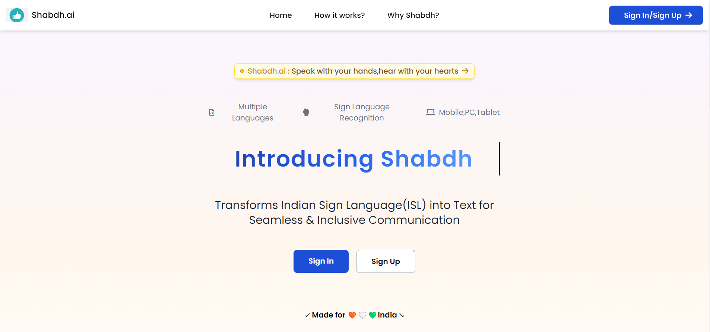
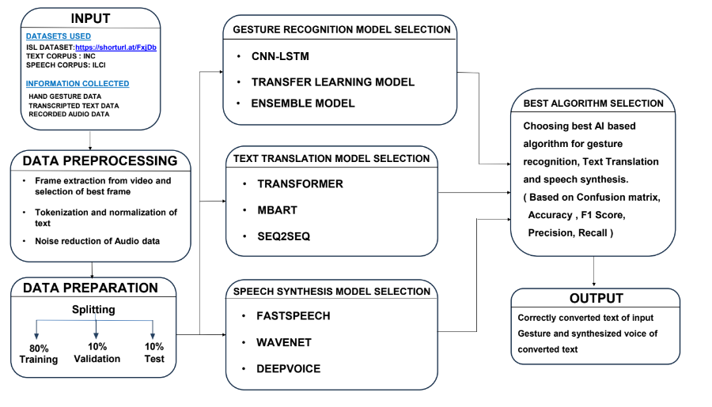
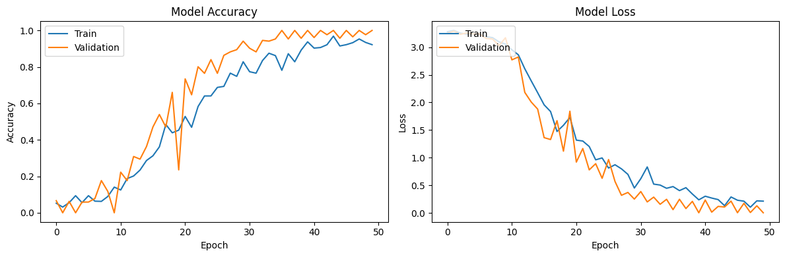

# Shabdh.AI

  

## Overview

**Shabdh.AI** is a groundbreaking platform designed to bridge the communication gap between the hard-of-hearing community and the hearing population. Using cutting-edge machine learning, Shabdh.AI translates Indian Sign Language (ISL) into real-time text and speech, fostering seamless communication in multiple Indian languages, such as English and Bengali. This innovation promotes inclusivity and accessibility for personal and professional interactions alike.

## Key Features

- **Gesture Recognition**: Captures ISL gestures in real-time and accurately interprets them.
- **Real-time Processing**: Delivers instant text and speech output based on recognized gestures.
- **Multilingual Support**: Provides translations into various Indian languages, ensuring flexibility and inclusivity.
- **Scalable Platform**: Designed to handle multiple users, making it adaptable for schools, businesses, and personal use.
- **Video Call Integration**: Facilitates real-time communication by integrating ISL translation in video calls.

## Product UI →

[Explore the Interface of  Shabdh.AI in action.](https://www.figma.com/proto/I9NrfRdIvWJap3ormr1v5N/Shabdh.ai?node-id=1-2&node-type=FRAME&t=Qy9Mya51ASK0GVYx-1&scaling=scale-down&content-scaling=fixed&page-id=0%3A1&starting-point-node-id=1%3A2)

## Demo Video →

[All about the Shabdh.Ai](https://youtu.be/3lr__5hgrkk?si=jX9JEbZikOXRm39y)

## Technology Stack

- **Frontend**: HTML5, CSS3, JavaScript
- **Backend**: Django, Python
- **Machine Learning**: Custom CNN model for gesture recognition with  upto 97% accuracy
- **Video Call**: WebRTC for video functionality
- **Database**: SQLite 
## System Architecture For Our Shabdh.Ai →

## Diagram For the  Model Accuracy and Model Loss For Shabdh.Ai

## Detailed Documentation
[Our Documentation and Research-work](https://drive.google.com/file/d/1lXu7cFUXcC9C43HRTHJFl3oHjLbJvxbB/view?usp=drive_link)
